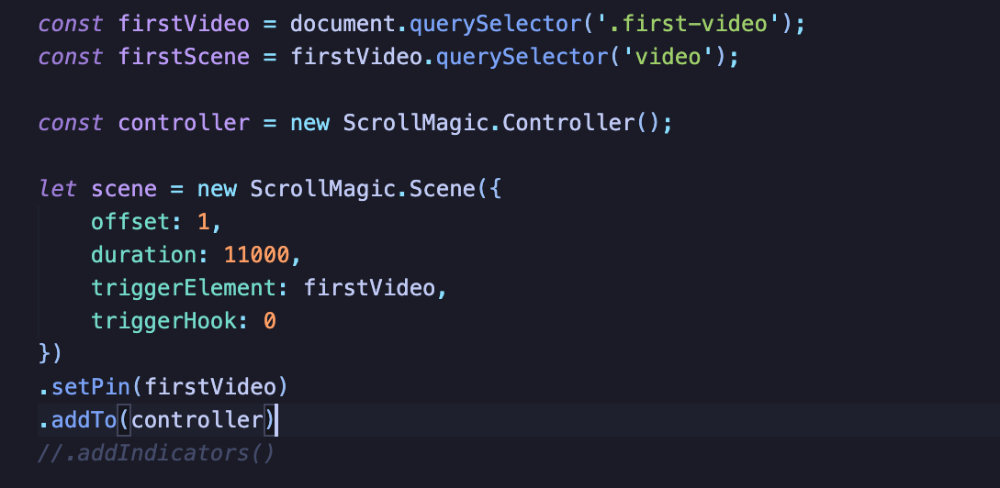
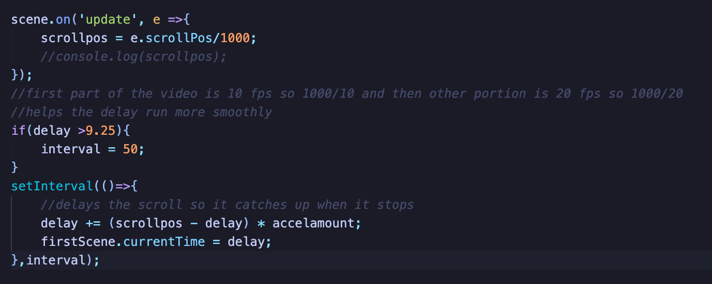
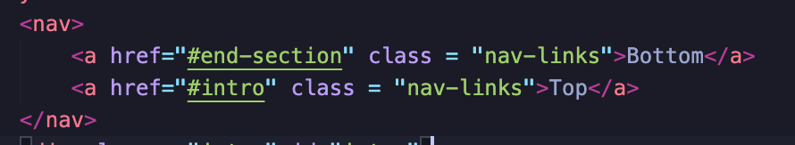

# scroll-animations

## Description 

[Deployed Link](https://hondahelix.github.io/scroll-animations/)

I recently was on Apple's website to purchase a new iPhone and was inspired by their on scroll animations to showcase their products. I made this little website to practice animating videos on scrolling. I did this by finding two gifs and combining and editing them into an mp4 file, which I was then able to animate, utilizing ScrollMagic.js. This was also a way for me to practice my CSS because I know I need to strengthen my CSS skills. I hope to improve the video's quality and implement this type of animation in my future projects!!

1. I wanted a video that animated when the user scrolled.

This code inits a Scroll Magic controller, which is used to keep track of the scenes. Then I create a scene; in this case, I only had one scene, which had a duration of 11 seconds. This video starts animating when the screen hits the trigger, which is the video. This also pins the video and prevents the page from scrolling down. 

2. I wanted the video to slowly ease to the point that the user scrolled instead of stopping immediately. 

This code is what sets the frames of the video to how much the user has scrolled. I created a variable that has a delay so that the video position gradually reaches the scroll's length. I did this by setting an interval that runs every 100 milliseconds at the beginning and then to every 50 milliseconds for the other half of the video. I did this because I think it makes the video run smoother, and the two videos I combined had different frames per second. 

3. I wanted the user to navigate to a point on the page instead of scrolling. 

This code enables page navigation if the user's hands get tired.

## Table of Contents
* [Usage](#usage)
* [Credits](#credits)
* [License](#license)
* [Badges](#badges)
* [Contact](#contact)
   
## Usage 

This project's usage was for me to get a better understanding and exposure to a new way to showcase a video on a website. I choose a cybercity because I liked the aesthetic and color palates associated with this type of art.

   
## Credits

I utilized the ScrollMagic.js library as well as watched a youtube tutorial on this library. I also used Imovie to edit the gifs into a video. The resources are linked below as well as the apple website that inspired me. 

[youtube link](https://youtu.be/wLUJ9VNzZXo)

[Scroll Magic](https://scrollmagic.io/)

[Apple](https://www.apple.com/iphone-12/)

## License

 MIT

## Badges

## Contact

[My Github](https://github.com/hondahelix) 

[My portfolio](https://hondahelix.github.io/react-portfolio/)